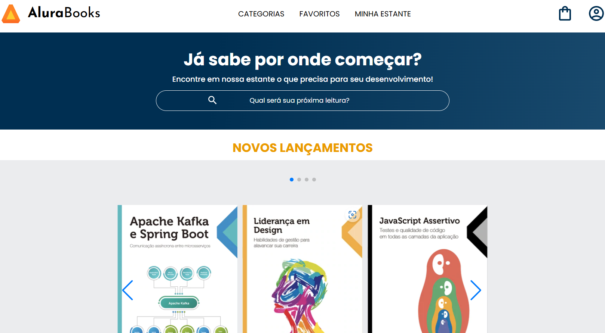

# Biblioteca Digital

Projeto idealizado com base nas aulas da Alura. Se trata de uma biblioteca digital, contendo categorias, carrinho de compras, campo de busca e etc.

## 🔨 Funcionalidades do projeto

O objetivo do projeto é aperfeiçoar as habilidade de HTML e CSS. Projeto ilustrativo sem fins comerciais. 

## ✔️ Técnicas e tecnologias utilizadas

-`HTML`
-`CSS`
-`Acessibilidade Web`

## 🛠️ Abrir e rodar o projeto

Para abrir e rodar o projeto, utilize um editor de código de sua escolha.
Depois, abra o projeto no seu navegador.

## VERCEL 
https://biblioteca-digital-five.vercel.app/
